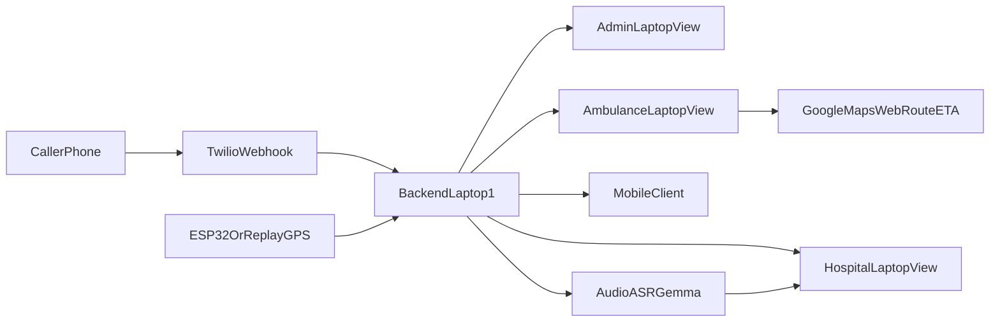

# SmartEVP 3-Laptop Demo Plan

## Goal
Deliver a deterministic live demo where: call intake appears instantly on admin, ambulance workflow updates in realtime, ambulance view shows Google Maps route+ETA, nurse audio generates medical brief, and hospital gets an incoming-patient alert with ETA + patient details.

## Current-State Understanding
- Existing system already has strong realtime backbone (`Flask + Socket.IO + MQTT`) and dashboard views in:
  - [C:/Users/sanjana/OneDrive/Desktop/SMART-EVP/Smart-EVP/Backend/app.py](C:/Users/sanjana/OneDrive/Desktop/SMART-EVP/Smart-EVP/Backend/app.py)
  - [C:/Users/sanjana/OneDrive/Desktop/SMART-EVP/Smart-EVP/Frontend/components/dashboard/views/admin-view.tsx](C:/Users/sanjana/OneDrive/Desktop/SMART-EVP/Smart-EVP/Frontend/components/dashboard/views/admin-view.tsx)
  - [C:/Users/sanjana/OneDrive/Desktop/SMART-EVP/Smart-EVP/Frontend/components/dashboard/views/ambulance-view.tsx](C:/Users/sanjana/OneDrive/Desktop/SMART-EVP/Smart-EVP/Frontend/components/dashboard/views/ambulance-view.tsx)
  - [C:/Users/sanjana/OneDrive/Desktop/SMART-EVP/Smart-EVP/Frontend/components/dashboard/views/hospital-view.tsx](C:/Users/sanjana/OneDrive/Desktop/SMART-EVP/Smart-EVP/Frontend/components/dashboard/views/hospital-view.tsx)
- Docs align with your 3-laptop setup and central-host model:
  - [C:/Users/sanjana/OneDrive/Desktop/SMART-EVP/Smart-EVP/Docs/01_HARDWARE_GUIDE (1).md](C:/Users/sanjana/OneDrive/Desktop/SMART-EVP/Smart-EVP/Docs/01_HARDWARE_GUIDE%20(1).md)
  - [C:/Users/sanjana/OneDrive/Desktop/SMART-EVP/Smart-EVP/Docs/02_BACKEND_AI_GUIDE (1).md](C:/Users/sanjana/OneDrive/Desktop/SMART-EVP/Smart-EVP/Docs/02_BACKEND_AI_GUIDE%20(1).md)
  - [C:/Users/sanjana/OneDrive/Desktop/SMART-EVP/Smart-EVP/Docs/03_FRONTEND_DESIGN_GUIDE.md](C:/Users/sanjana/OneDrive/Desktop/SMART-EVP/Smart-EVP/Docs/03_FRONTEND_DESIGN_GUIDE.md)

## Architecture to Implement (Chosen)
- **Single source of truth:** Backend on Laptop 1.
- **Realtime transport:** Socket.IO from backend to all three laptop browser clients + mobile client.
- **Persistence:** keep lightweight SQLite/in-memory for demo state; no heavy DB required for this phase.
- **Navigation:** embed Google Maps web route + live ETA in ambulance view (browser-safe).

## Implementation Phases

### Phase 1 — Stabilize Event Contract (Highest Priority)
- Normalize backend event payloads so UI status chips always render correctly (e.g., dispatch/sms/driver fields consistency).
- Add explicit case lifecycle states: `CALL_RECEIVED -> DISPATCHED -> EN_ROUTE_TO_PATIENT -> PATIENT_PICKED -> EN_ROUTE_TO_HOSPITAL -> ARRIVING`.
- Ensure all views consume the same typed event model from `use-socket` hook:
  - [C:/Users/sanjana/OneDrive/Desktop/SMART-EVP/Smart-EVP/Frontend/hooks/use-socket.ts](C:/Users/sanjana/OneDrive/Desktop/SMART-EVP/Smart-EVP/Frontend/hooks/use-socket.ts)
  - [C:/Users/sanjana/OneDrive/Desktop/SMART-EVP/Smart-EVP/Frontend/lib/socket.ts](C:/Users/sanjana/OneDrive/Desktop/SMART-EVP/Smart-EVP/Frontend/lib/socket.ts)

### Phase 2 — Landing Page as Demo Router (3 Boxes)
- Update landing page to show three explicit launcher cards (Admin / Ambulance / Hospital).
- Each card deep-links to correct route with clear labels for each laptop role.
- Keep this as your operator-friendly pre-demo control panel:
  - [C:/Users/sanjana/OneDrive/Desktop/SMART-EVP/Smart-EVP/Frontend/app/page.tsx](C:/Users/sanjana/OneDrive/Desktop/SMART-EVP/Smart-EVP/Frontend/app/page.tsx)

### Phase 3 — Ambulance Route + ETA (Google Maps Web)
- Add Google Maps Directions URL/module in ambulance view for “navigate to patient” then “navigate to hospital”.
- Add state transition button(s): `PatientPicked` then `ProceedToHospital` that emit backend events.
- Display live ETA in ambulance and rebroadcast to hospital/admin views.

### Phase 4 — Nurse Audio Module (Simple + Reliable)
- Add simple “push-to-talk / record / submit” UI in ambulance screen with fallback to existing demo audio trigger.
- Backend path: transcript publish -> brief generation -> hospital/admin update.
- Ensure visible progress states (`listening`, `transcribing`, `brief_ready`) for demo confidence.

### Phase 5 — Hospital Incoming Alert Workflow
- Add prominent incoming alert banner/toast when patient heading to hospital.
- On open: show ETA, diagnosis/vitals/resources, and patient details from current brief model.
- Keep this deterministic even if ASR fails (fallback brief path).

### Phase 6 — Demo Reliability and Runbook
- Add one-click “demo reset” and optional “scripted flow trigger” endpoint for repeatable judging runs.
- Verify cross-laptop URL strategy (`http://Laptop1_IP:<port>`) and websocket connectivity.
- Prepare fallback matrix: Twilio down, GPS weak, ASR/API down.

## Why No Heavy DB Now
- For this demo, central backend + websocket state is enough and fastest.
- Add database only for post-demo needs (history, auth, replay analytics, multi-session persistence).

## Verification Checklist (Acceptance)
- Call event appears on Admin within 1–2s.
- Ambulance status transitions propagate to all views in realtime.
- Ambulance view opens Google Maps route and shows ETA.
- Nurse audio submission updates transcript + hospital brief.
- Hospital gets incoming alert and can open ETA + patient details.
- Full flow repeatable after reset without app restart.