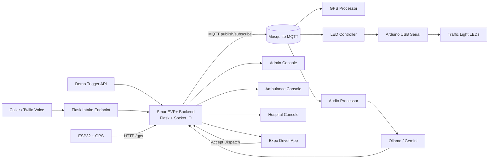
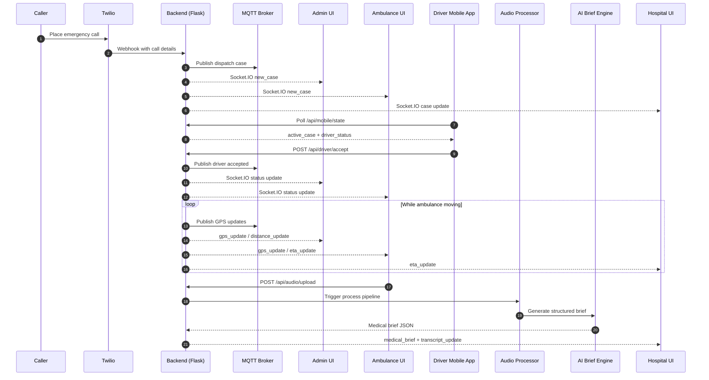
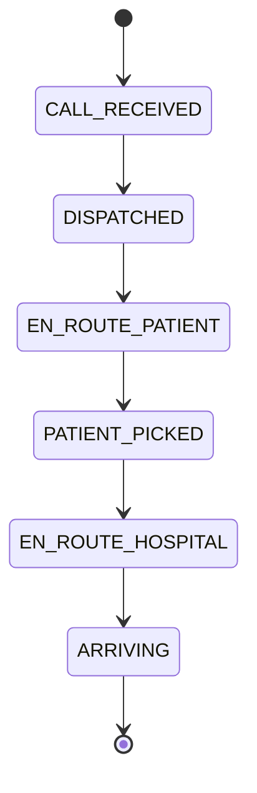

# SmartEVP+
SmartEVP+ is an emergency response orchestration platform that combines:
- **Realtime traffic preemption logic** (MQTT + hardware bridge)
- **Multi-role web consoles** (Admin, Ambulance, Hospital)
- **AI-assisted medical brief generation** (Ollama/Gemini fallback chain)
- **Mobile driver companion app** (Expo React Native with dispatch alerts)

The repository is organized as a multi-app workspace with one backend service and two clients (web + mobile) used together during demo and validation flows.

## The problem SmartEVP+ solves
Emergency response in dense city traffic fails for two recurring reasons:
- **Critical delay at intersections:** ambulances lose time waiting behind normal traffic flow.
- **Fragmented communication:** dispatch, ambulance crew, and hospital often do not share synchronized live context.
- **Late clinical context at hospital:** hospitals receive incomplete pre-arrival information, reducing preparation time for trauma/cardiac cases.

SmartEVP+ addresses this by combining realtime dispatch orchestration, signal preemption logic, GPS-aware routing state, and AI-assisted medical summarization into one coordinated control loop.

## Project overview
SmartEVP+ is designed as a coordinated emergency operations system with:
- **One backend control plane** (state, events, orchestration, APIs)
- **Three operational web roles** (Admin, Ambulance, Hospital)
- **One mobile driver companion** (dispatch acceptance + alerts)
- **IoT hardware edge** (ESP32 GPS telemetry + Arduino traffic signal LED controller)

The result is a deterministic end-to-end workflow:
1. Case is created (Twilio intake or demo trigger).
2. Dispatch state is broadcast to all consoles and driver app.
3. GPS feed continuously updates ambulance distance and ETA.
4. Preemption logic triggers green-corridor signaling near target intersection.
5. Audio transcript + AI medical brief are generated and shown to hospital before arrival.

## System architecture (high level)


## Emergency lifecycle flow


## Hardware components
### Core hardware (demo setup)
- **Laptop 1 (control host)**  
  Runs backend services, MQTT broker, and optionally frontend host.
- **Laptop 2 (ambulance operations view)**  
  Displays ambulance UI and live route/ETA workflow.
- **Laptop 3 (hospital readiness view)**  
  Displays incoming patient alerts and medical brief.
- **Arduino Uno/Nano + Red/Yellow/Green LEDs**  
  Receives USB serial commands and simulates traffic signal preemption.
- **ESP32 + NEO-6M GPS module**  
  Sends live ambulance location data to backend.
- **Toy ambulance platform + power bank**  
  Physical carrier for ESP32/GPS during demo movement.

### Optional/operational peripherals
- **USB microphone** for paramedic voice capture flow.
- **Phone 1** for emergency caller simulation.
- **Phone 2** with Expo app for driver dispatch acceptance + notifications.

## Software components
### Backend and orchestration (`Backend/`)
- **`app.py`**: central Flask + Socket.IO server, API endpoints, state fanout.
- **`start_all.py`**: process orchestrator for all backend services.
- **`gps_processor.py`**: computes distance to target and triggers preemption.
- **`led_controller.py` + `arduino_controller.py`**: converts MQTT signal commands to Arduino serial actions.
- **`audio_processor.py`**: transcript pipeline and medical brief trigger.
- **`gemma_processor.py`**: AI brief generation with provider fallback chain.
- **`intake_server.py`**: Twilio voice intake blueprint.

### Web operations console (`Frontend/`)
- **Next.js role-based interfaces**:
  - `/admin` for command center
  - `/ambulance` for field unit status
  - `/hospital` for readiness + brief
- **`hooks/use-socket.ts`** handles realtime event synchronization.

### Mobile driver app (`Mobile/`)
- Expo React Native app for:
  - dispatch polling and active case display
  - driver accept flow (`POST /api/driver/accept`)
  - push token registration and notification handling

### Messaging and realtime transport
- **MQTT (Mosquitto)** for service-to-service event bus.
- **Socket.IO** for low-latency UI broadcasting.

## Case status state machine


## How everything works together (end-to-end)
1. **Intake phase**  
   Emergency case is created from Twilio voice workflow or demo trigger API.
2. **Dispatch phase**  
   Backend publishes case event to MQTT, then broadcasts to all web views and mobile.
3. **Acceptance phase**  
   Driver accepts via mobile; backend updates global state and emits acknowledgement.
4. **Transit phase**  
   GPS updates are ingested and converted into distance + ETA + corridor trigger decisions.
5. **Preemption phase**  
   Once threshold is reached, LED controller drives Arduino to flip signal state.
6. **Clinical intelligence phase**  
   Audio transcript is processed and converted into structured medical brief.
7. **Hospital readiness phase**  
   Hospital console receives incoming ETA + transcript + AI brief before arrival.

## Repository structure
```text
SmartEVP+/
├─ Backend/      # Flask + Socket.IO + MQTT microservices, Twilio intake, AI pipeline
├─ Frontend/     # Next.js dashboard + role-based web consoles
├─ Mobile/       # Expo React Native driver app
├─ Docs/         # Setup guides, runbooks, and architecture notes
└─ Reference/    # Local reference material (ignored from git)
```

## Core capabilities
- **Emergency intake and dispatch trigger**
  - Twilio webhook support (`/twilio/*`) when credentials are configured
  - Manual demo triggers (`POST /demo/trigger`, `POST /demo/full-flow`)
- **Live operations state**
  - Socket.IO event fanout for case lifecycle, GPS, signal status, ETA, transcript, brief
  - Role-specific UI: `/admin`, `/ambulance`, `/hospital`
- **Traffic signal corridor preemption**
  - GPS distance processing against configured intersection
  - MQTT preempt/reset topics for hardware controller integration
- **Audio-to-brief medical workflow**
  - Audio upload and processing trigger (`POST /api/audio/upload`)
  - Transcript publication + structured brief generation
  - Provider chain: Ollama -> Gemini -> fallback brief
- **Mobile dispatch experience**
  - Polling-based state sync from `/api/mobile/state`
  - Driver accept action via `POST /api/driver/accept`
  - Expo push token registration via `POST /api/mobile/push-token`

## Tech stack
- **Backend:** Python, Flask, Flask-SocketIO, paho-mqtt, Twilio SDK
- **Web frontend:** Next.js, React, TypeScript, Tailwind + Radix UI
- **Mobile:** Expo, React Native, React Navigation, Expo Notifications
- **Messaging/runtime:** Mosquitto MQTT broker + Socket.IO transport

## Prerequisites
- Python **3.10+**
- Node.js **20+** and npm
- Mosquitto MQTT broker running on `localhost:1883`
- (Optional) Twilio credentials for call intake/SMS
- (Optional) Hugging Face API key for live ASR
- (Optional) Ollama/Gemini credentials for enhanced AI briefing
- (Optional) Arduino/hardware bridge for real traffic signal demo

## Quick start (Windows PowerShell)
### 1) Backend setup
```powershell
cd D:\Projects\SmartEVP+\Backend
py -3 -m venv .venv
.\.venv\Scripts\Activate.ps1
pip install -r requirements.txt
Copy-Item .env.example .env
python start_all.py
```

Expected backend URLs:
- API base: `http://localhost:8080`
- Health: `http://localhost:8080/api/health`

### 2) Frontend setup
```powershell
cd D:\Projects\SmartEVP+\Frontend
npm install
Copy-Item .env.example .env.local
npm run dev
```

Open:
- Landing page: `http://localhost:3000`
- Demo launcher: `http://localhost:3000/?demo=1`
- Direct role routes:
  - `http://localhost:3000/admin`
  - `http://localhost:3000/ambulance`
  - `http://localhost:3000/hospital`

### 3) Mobile setup (Expo)
```powershell
cd D:\Projects\SmartEVP+\Mobile
npm install
Copy-Item .env.example .env
$env:EXPO_PUBLIC_BACKEND_URL="http://<YOUR_LAPTOP_IP>:8080"10.93.229.237
npx expo start -c
```

Then scan the Expo QR code on a phone connected to the same network.

## Environment variables
### Backend (`Backend/.env`)
See `Backend/.env.example`.

Important keys:
- `TWILIO_ACCOUNT_SID`, `TWILIO_AUTH_TOKEN`, `TWILIO_FROM_NUMBER`, `DRIVER_PHONE`
- `HF_API_KEY`
- `OLLAMA_BASE_URL`, `OLLAMA_MODEL`
- `GEMINI_API_KEY`, `GEMINI_MODEL`

### Frontend (`Frontend/.env.local`)
See `Frontend/.env.example`.

- `NEXT_PUBLIC_BACKEND_URL=http://localhost:8080`
- `NEXT_PUBLIC_GOOGLE_MAPS_KEY=` (optional, if map integration is expanded)

### Mobile (`Mobile/.env`)
See `Mobile/.env.example`.

- `EXPO_PUBLIC_BACKEND_URL=http://<YOUR_LAPTOP_IP>:8080`

If unset, mobile attempts to infer backend host from Expo debugger host.

## API reference (high value endpoints)
### Health & state
- `GET /api/health` -> backend + MQTT health
- `GET /api/state` -> full backend state snapshot
- `GET /api/mobile/state` -> mobile-optimized state
- `GET /api/eta` -> ETA and distance summary
- `GET /api/health/network` -> configured host/port metadata

### Dispatch and flow control
- `POST /demo/trigger` -> create a demo case + start scripted route flow
- `POST /demo/full-flow` -> launch scripted 3-laptop sequence
- `POST /api/reset` -> reset server demo state
- `POST /api/case/status` -> manually update case lifecycle state
- `POST /gps` -> inject GPS coordinate updates

### Mobile + audio
- `POST /api/driver/accept` -> mark driver acceptance
- `POST /api/mobile/push-token` -> register Expo push token
- `POST /api/audio/upload` -> upload paramedic audio for processing
- `POST /demo/audio` -> trigger audio processing pipeline

## MQTT topic map
### Inputs consumed by backend/services
- `smartevp/ambulance/gps`
- `smartevp/signal/preempt`
- `smartevp/signal/reset`
- `smartevp/command/process_audio`

### Outputs published by backend/services
- `smartevp/ambulance/distance`
- `smartevp/signal/status`
- `smartevp/dispatch/case`
- `smartevp/dispatch/sms_sent`
- `smartevp/driver/accepted`
- `smartevp/medical/transcript`
- `smartevp/medical/brief`

## 3-laptop demo flow (recommended)
1. Start backend orchestration (`python start_all.py`) on Laptop 1.
2. Start frontend on each laptop, all pointed to Laptop 1 backend URL.
3. Assign views:
   - Laptop 1 -> Admin (`/admin`)
   - Laptop 2 -> Ambulance (`/ambulance`)
   - Laptop 3 -> Hospital (`/hospital`)
4. Trigger the demo from Admin UI or call:
   - `POST http://localhost:8080/demo/trigger`
5. Observe synchronized progression:
   - Case open -> dispatch -> route updates -> preemption -> transcript/brief.

## Scripts
### Backend
- `python start_all.py` -> starts LED/GPS/Audio processors + Flask app
- `python app.py` -> run Flask app alone

### Frontend
- `npm run dev` -> development server
- `npm run build` -> production build
- `npm run start` -> run production server
- `npm run lint` -> lint checks

### Mobile
- `npm run start` -> Expo start
- `npm run android` -> open Android flow
- `npm run ios` -> open iOS flow
- `npm run web` -> Expo web target
- `npm run typecheck` -> TypeScript checks

## Troubleshooting
- **Backend exits on startup**: ensure Mosquitto is running on `127.0.0.1:1883`.
- **Frontend cannot connect to backend**: verify `NEXT_PUBLIC_BACKEND_URL` and LAN reachability on port `8080`.
- **Mobile not receiving dispatch**:
  - confirm same network as backend
  - verify `EXPO_PUBLIC_BACKEND_URL`
  - allow notification permissions in Expo Go
- **No transcript/brief updates**:
  - ensure `audio_processor.py` is running
  - provide API keys or use fallback demo mode

## Additional documentation
Detailed runbooks and deep-dive guides are available in `Docs/`:
- `Docs/01_HARDWARE_GUIDE (1).md`
- `Docs/02_BACKEND_AI_GUIDE (1).md`
- `Docs/03_FRONTEND_DESIGN_GUIDE (3).md`
- `Docs/DEMO_RUNBOOK.md`
- `Docs/Mobile_app.md`
- `Docs/GOOGLE_MAPS_API_GUIDE.md`

## GitHub push checklist
Before pushing:
1. Confirm secrets are **not** committed (`.env`, API keys, credentials).
2. Run:
   - Frontend: `npm run lint`
   - Mobile: `npm run typecheck`
   - Backend: quick startup health check via `/api/health`
3. Update docs if routes/endpoints changed.

First push pattern:
```powershell
git -C D:\Projects\SmartEVP+ add .
git -C D:\Projects\SmartEVP+ commit -m "docs: add repository documentation and GitHub templates"
git -C D:\Projects\SmartEVP+ branch -M main
git -C D:\Projects\SmartEVP+ remote add origin https://github.com/<your-org>/<your-repo>.git
git -C D:\Projects\SmartEVP+ push -u origin main
```

## Contributing and security
- Contribution guide: `CONTRIBUTING.md`
- Security policy: `SECURITY.md`
- Community standards: `CODE_OF_CONDUCT.md`
